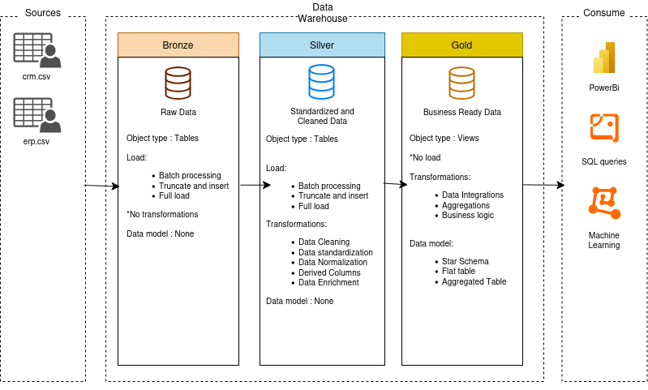
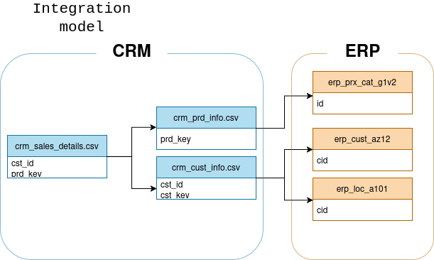

# Data-Warehouse

This project is a primitive data warehouse built with postgres and python. It is a project meant for self-learning. It is semi-automated and can handle new batch data ingestion without failure so long as the data's dirtiness remains within constraints. 

It was built with the medallion architecture and covers the bronze, silver and gold layer with automated scripts for the bronze and silver layers ( for the ingestion and cleaning of raw data. )

## Functions and tools

The main goal of this ETL pipeline is to ingest dirty data from CSVs, clean them, add proper business and analytics-derived constraints and then making a star-schema for easy and efficient analystical queries in the future. SQL was used to ingest, clean and integrate data into postgres from my local system whilst Python along with the .env and psycopg3 libs were used to orchestrate the data warehouse, allowing for automation and secure accessing of sensitive business data. 

CSV data used is processed in batches. Additional CSVs may be added with slight modifications to the orchestration scripts. The silver_layer.py and bronze_layer.py scripts are intentionally segmented into 2 different scripts to ensure easy debugging in case of future data straying from the current system constraints. 

For the Gold Layer, a star schema was used instead of a snowflake-style view design. This was an intentional system architetcure design choice. The reasoning for such a design choice stemmed from the fact that the raw data complexity was not high enough to warrant a snowflake-style design. A star-schema can be easily converted into a snowflake-style view design if future analytics demand requires it.

Draw.io was used to plan to basic system archietcure as well as to design the final integration model for the gold layer. Both diagrams are included in the repository under intergration_model/png and system_architecture_plan.png. Good documentation is non-negotioable in systems that are being built to scale up. 

## Project constraints

The current model is fairly scalable given that the dirtyness of the raw data ingested is limited to a certain degree. This data-warehouse is not containerized or embedded with other tools like for example, DataBricks or a dashboard tool. As a result, it is very lightweight but lacks in scalability, real time data streaming and robust features. For future projects, it is probably better for me to add in a few more implementations to any given pipeline for increased scalability, ideas include but are not limited to things like a centralized platform ( eg. DataBricks where connections with other tools like powerBI or dbt Cloud is made much easier with inbuilt dashboard tooling ) or containerization technologies like docker for easy deployment on multiple systems and the handling of dependencies ( as my scripts utilize multiple libraries ).

## Possible future implementations

Docker
Data Visualisation tooling



## Project Structure

```
Data-Warehouse/
├── Datasets/                        # Source CSV files
│   └── source_crm/
│   └── source_erp/
├── python_scripts/                  # Automation scripts
│   ├── bronze_layer_automation.py
│   └── silver_layer_automation.py
├── sql_scripts/
│   ├── bronze_layer/
│   │   ├── bronze_ddl.sql
│   │   └── bulk_insert/
│   ├── silver_layer/
│   │   ├── silver_init/
│   │   └── silver_cleaning/
│   └── gold_layer/
│       ├── customers_dim.sql
│       ├── products_dim.sql
│       └── fact_sales.sql
└── README.md
```
## Tech Stack

- **Database**: PostgreSQL
- **Automation**: Python 3 with `psycopg` and `python-dotenv`

Conventions used for the project

- Snakcase naming ( eg. main_file.py, calculate_limit.cpp )
- Developed incrementally with Git version control
- Language : English only

Bronze Rules

- Names must start with source system name and table names must match their original names
- **`<sourcesystem>_<entity>`**
    - **`<sourcesystem>`** : Name from the source file of said data
    - **`<entity>`** : Name of the referenced table, must match exactly
        - Example : **`crm_car_sales`** is named the way it is because it is from the `crm` raw data .csv and the table is named, in this case `car_sales`.

Silver Rules

- Names must start with source system name and table names must match their original names
- **`<sourcesystem>_<entity>`**
    - **`<sourcesystem>`** : Name from the source file of said data
    - **`<entity>`** : Name of the referenced table, must match exactly
        - Example : **`crm_car_sales`** is named the way it is because it is from the `crm` raw data .csv and the table is named, in this case `car_sales`.

Gold Rules

- All names must be meaningfuland business aligned for table, starting with prefixes based onh category. 
- **`<category>_<entity>`**
    - **`<cateogory> `**: Describes the role of the table, such as **`<dim>`** for dimension or **`<fact>`** for factsheets. 
    - **`<entity>`** : Descriptive name of the table aligned with the business domain (eg. **`<customers>`**, **`<product>`**, **<sales>**)

        - Examples:
            - **`<customers>`** refers to a table for customers data
            - **`<product>`** refers to a products data

Integration model for the gold year to dictate star schema logic:



Glossary of Category Patterns

| Pattern | Meaning | Example(s) |
|---|---| --- |
| **`dim_`** | Dimension | **`dim_date`**, **`dim_location`**|
| **`fact`** | Factsheet | **`fact_sales`**|
| **`report_`** | Report | **`report_customers`**, `report_users`| 

## Column naming conventions

### Surrogate Keys

- All primary keys in the dimension table must end with **`-key`**
- **`<table_name>`**_**`key`**

### Technical columns

- All technical columns must by preceded with the prefix **`dwh_`** and followed by a name that describes the pupose of the table
- **`dwh_columnname`**

## Stored procedure

- All stored procedures must be preceded by **`load_`** and followed by the layer being loaded (eg. **`silver`**, **`gold`**, **`bronze`**)


